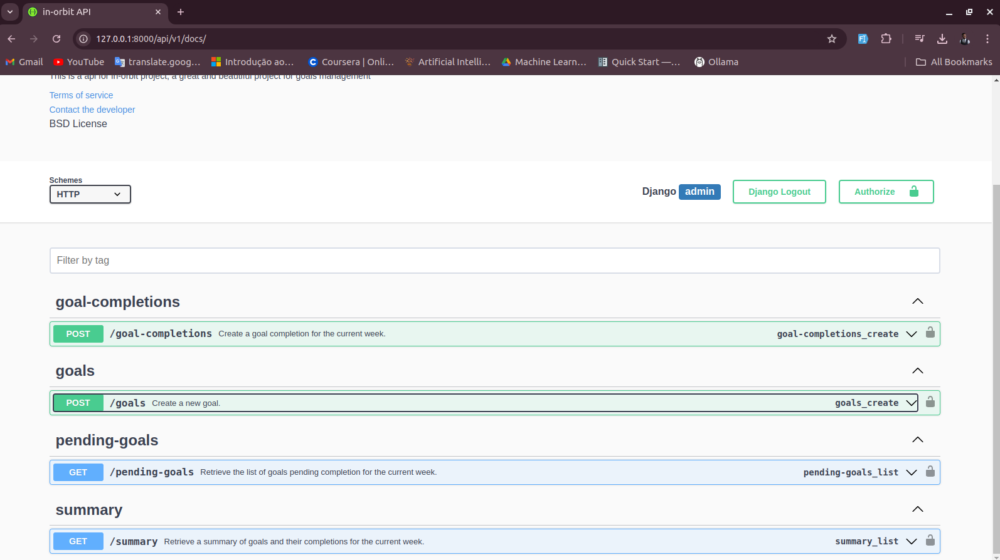

[MAINTENANCE_BADGE]: https://img.shields.io/badge/Maintained%3F-yes-green.svg
[PYTHON_BADGE]: https://img.shields.io/badge/python-3670A0?style=for-the-badge&logo=python&logoColor=ffdd54
[LICENSE_BADGE]: https://img.shields.io/pypi/l/ansicolortags.svg
[DJANGO_BADGE]:https://img.shields.io/badge/django-%23092E20.svg?style=for-the-badge&logo=django&logoColor=white

<h1 align="center" style="font-weight: bold;"> in-orbit-django-rest-api 💻</h1>

![Python][PYTHON_BADGE]
![Django][DJANGO_BADGE]
![License][LICENSE_BADGE]
![Maintenance][MAINTENANCE_BADGE]

`Content:`

<ul>
    <li><a href="#about">About</a></li>
    <li><a href="#features">Features</a></li>
    <li>
      <a href="#gettingStarted">Getting Started</a>
    </li>
    <li><a href="#howToRun">How To Run</a></li>
    <li><a href="#routes">API Endpoints</a></li>
    <li><a href="#collaborators">Collaborators</a></li>
    <li><a href="#contribute">Contribute</a></li>
    <li><a href="#license">License</a></li>
</ul>

<p align="center">
    
</p>

<h2 id="about">📌 About</h2>

<p>
This is a Goal Management System API built with Django Rest Framework (DRF). The objective of this project is to create a structured and efficient way to manage daily and weekly goals. The API allows users to create goals, mark goals as completed, retrieve all pending goals, and generate a detailed weekly summary of completed goals.
</p>

Here’s a "Features" section for your API:

---

<h2 id="features">📄Features</h2>

- **User Authentication and Authorization:** Users can register, log in, and manage their own goals. Authentication is handled via JWT, ensuring secure access to user-specific data.

- **Goal CRUD Operations:** Create, read, update, and delete goals with customizable fields such as title, description, deadline, and completion status.

- **Goal Completion Tracking:** Mark goals as completed, and easily track progress by viewing pending or completed goals.

- **Weekly Goal Summary:** Get a detailed weekly summary of all goals completed, helping users review their accomplishments and stay motivated.

- **Pending Goal Filtering:** Easily retrieve all pending goals to focus on tasks that need attention.

- **Goal Pagination:** Pagination in goal search queries ensures efficient handling of large goal lists.


<h2 id="gettingStarted">🚀 Getting started</h2>

This section describes how you can run this project locally.


<h2 id="howToRun">🔗 How to Run</h2>

- Clone the project repository from GitHub:

```bash
git clone git@github.com:EriveltoSilva/in-orbit-django-rest-api.git
```

- Navigate to the project directory and install the virtual environment:

```bash
cd in-orbit-django-rest-api
virtualenv .venv
```

- Install the required dependencies:
```bash
pip install -r requirements.txt
```

- Copy the .env.example to .env:
```bash
cp .env.example .env
```

- Open .env file;
- Fill project SECRET_KEY;
- Choose the right database config uncommenting that and leave others commented;

- Start project
```bash
python manage.py runserver
```

<h2 id="routes">📍 API Endpoints </h2>

Here is a comprehensive list of the primary API endpoints, along with the expected request bodies and responses for each route.
**Note:All endpoint starts with: http://localhost:8000/api/v1**

<h3> Authentication </h3>

| Route                                  | Description                                         |
|----------------------------------------|-----------------------------------------------------|
| <kbd> POST /goals </kbd>       | Create a new goal                                           |
| <kbd> POST /goal-completions </kbd>       | Mark add a completions on a specific goal        |
| <kbd> GET /pending-goals </kbd>     | Get all week pending goals                            |
| <kbd> GET /summary</kbd>     |    Get a week summary                                         |


<h3> POST /goals </h3>

**REQUEST BODY**
```json
{
    "title": "Run",
    "desiredWeeklyFrequency":3
}
```

**RESPONSE**
```json
{
    "id": "0ff4829a-8a6e-4281-b020-5bbf9d457622",
    "title": "Run",
    "desiredWeeklyFrequency": "3",
    "created_at": "2024-09-16T23:58:06.154313+01:00"
}
```

<h3> POST /goal-completions </h3>

**REQUEST BODY**
```json
{
    "goalId": "0ff4829a-8a6e-4281-b020-5bbf9d457622"
}
```

**RESPONSE**
```json
{
    "id": "9b3187d5-6d9f-4614-ad1b-75384c6f824b",
    "goal": "0ff4829a-8a6e-4281-b020-5bbf9d457622",
    "created_at": "2024-09-16T23:59:50.517701+01:00"
}
```


<h3> GET /pending-goals </h3>

**RESPONSE**
```json
{
    "pending_goals": [
        {
            "id": "0ff4829a-8a6e-4281-b020-5bbf9d457622",
            "title": "Run",
            "desiredWeeklyFrequency": "3",
            "completionsCount": 1
        },
        {
            "id": "4a88a607-982b-4e6a-8f9a-6a11ac9e11df",
            "title": "Nadar",
            "desiredWeeklyFrequency": "5",
            "completionsCount": 5
        },
        {
            "id": "1ea584eb-b086-49ea-a1ce-a4bde3c7a856",
            "title": "Ouvir Radio",
            "desiredWeeklyFrequency": "2",
            "completionsCount": 0
        },
        {
            "id": "1668ea47-b781-438d-a981-78c5393a7a6f",
            "title": "Comer maça",
            "desiredWeeklyFrequency": "2",
            "completionsCount": 0
        },
        {
            "id": "d6a44e93-d883-40a4-8cb3-655f6116a7f6",
            "title": "Meditar",
            "desiredWeeklyFrequency": "1",
            "completionsCount": 0
        },
        {
            "id": "c87b62e4-43e4-4da8-b82a-17f9d14d83b8",
            "title": "Acordar cedo",
            "desiredWeeklyFrequency": "5",
            "completionsCount": 0
        }
    ]
}
```

<h3> GET /summary </h3>

**RESPONSE**
```json
{
    "summary": {
        "completed": 6,
        "total": 18,
        "goals_per_day": {
            "2024-09-16": {
                "completions": 6,
                "goals_info": [
                    {
                        "id": "0ff4829a-8a6e-4281-b020-5bbf9d457622",
                        "title": "Run",
                        "created_at": "2024-09-16T22:58:06.154313Z"
                    },
                    {
                        "id": "4a88a607-982b-4e6a-8f9a-6a11ac9e11df",
                        "title": "Nadar",
                        "created_at": "2024-09-16T16:55:55.236274Z"
                    },
                    {
                        "id": "4a88a607-982b-4e6a-8f9a-6a11ac9e11df",
                        "title": "Nadar",
                        "created_at": "2024-09-16T16:55:55.236274Z"
                    },
                    {
                        "id": "4a88a607-982b-4e6a-8f9a-6a11ac9e11df",
                        "title": "Nadar",
                        "created_at": "2024-09-16T16:55:55.236274Z"
                    },
                    {
                        "id": "4a88a607-982b-4e6a-8f9a-6a11ac9e11df",
                        "title": "Nadar",
                        "created_at": "2024-09-16T16:55:55.236274Z"
                    },
                    {
                        "id": "4a88a607-982b-4e6a-8f9a-6a11ac9e11df",
                        "title": "Nadar",
                        "created_at": "2024-09-16T16:55:55.236274Z"
                    }
                ]
            }
        }
    }
}
```
<h2 id="swagger">🖼️ Swagger API Doc</h2>

<p align="center">
    
    
</p>


<h2 id="collaborators">🤝 Collaborators</h2>

Special thank you for all people that contributed for this project.

<table>
  <tr>
    <td align="center">
      <a href="https://erivelto-silva-portfolio.vercel.app/">
        <br>
        <sub>
          <b>Erivelto Silva</b>
        </sub>
      </a>
    </td>
  </tr>
</table>


<h2 id="contribute">📫 Contribute</h2>

1. `git clone git@github.com:EriveltoSilva/in-orbit-django-rest-api.git`
2. `git checkout -b feature/NAME`
3. Follow commit patterns
4. Open a Pull Request explaining the problem solved or feature made, if exists, append screenshot of visual modifications and wait for the review!


<h2 id="license"></h2>License</h2>

This project is licensed under the MIT License - see the <a href="./LICENSE.txt">LICENSE</a> file for details.